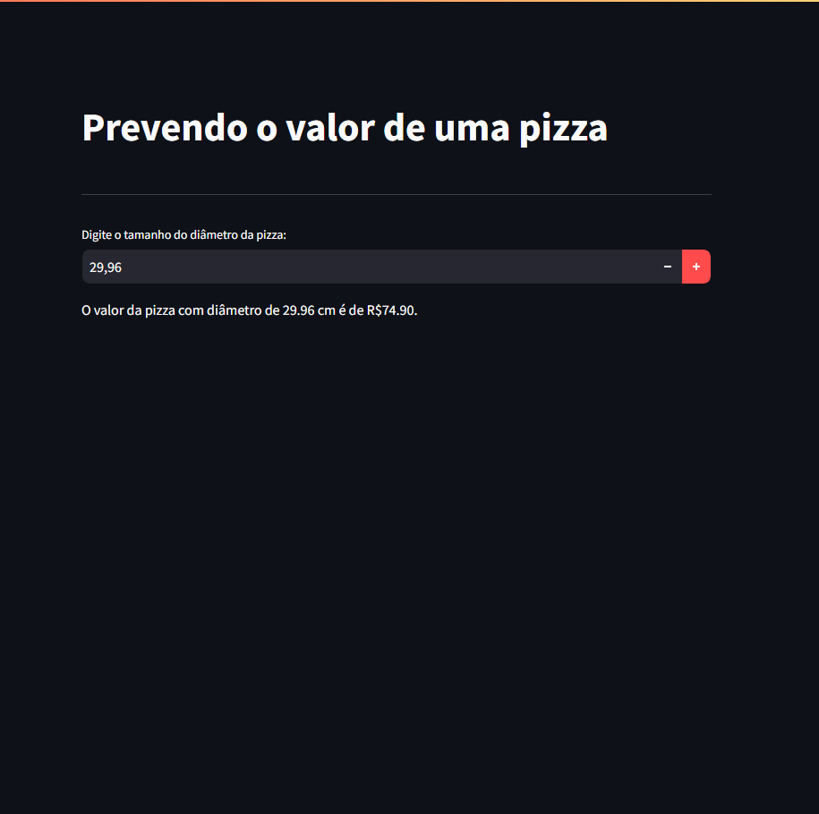

# Projeto Em Machine Learning

 O projeto desenvolvido com Machine Learn onde tive conheciento de de como é o funcionamento, nessse projeto como podemos ver na imagem estamos prevendo um valor de uma pizza a partir do seu diâmetro.
 

 Segue ás biblioteca que foi utilizada para o funcionamento do programa web.
<li>Streamlit</li>
<li>Matplotlib</li>
<li>Scikit-learn</li>
<li>Pandas</li>
<li>sklearn</li>

